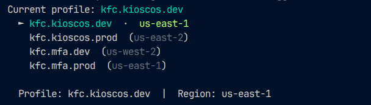
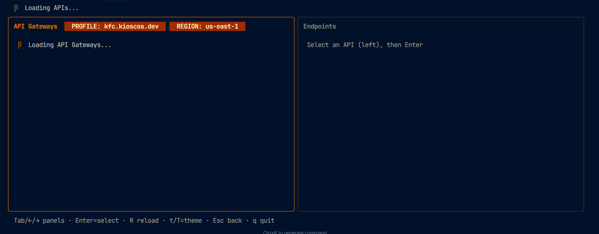

# awsp – AWS Profile Switcher

CLI para cambiar perfiles y regiones de AWS de forma interactiva. Incluye API Gateway y CloudWatch Logs.

## Instalación

Un solo comando (no requiere Go):

```bash
curl -sSL https://raw.githubusercontent.com/danixts/awsp/main/install.sh | bash
```

Reinicia la terminal o ejecuta `source ~/.zshrc`.

## Uso

| Comando | Descripción |
|---------|-------------|
| `awsp` | Menú interactivo: elegir perfil y región, aplicar en la shell |
| `awsp -g` o `awsp --gateway` | API Gateway: listar APIs, ver métodos y logs |
| `awsp -l` o `awsp --logs` | CloudWatch Logs: listar grupos y ver logs en tiempo real |
| `awsp switch [perfil] [región]` | Cambiar perfil (sin args = interactivo) |
| `awsp list` | Listar perfiles (★ = favorito) |
| `awsp current` | Ver perfil actual |
| `awsp favorite add <perfil>` | Añadir favorito |
| `awsp favorite remove <perfil>` | Quitar favorito |
| `awsp favorite list` | Listar favoritos |
| `awsp install` | Configurar shell (PATH, awsp, completion) |

**Flags globales**

- `-v`, `--validate` — Comprobar credenciales antes de exportar
- `-f`, `--full` — Incluir `AWS_SDK_LOAD_CONFIG=1` en el export

**Ejemplos**

```bash
awsp                          # menú perfil/región
awsp -g                       # abrir API Gateway
awsp -l                       # abrir CloudWatch Logs
awsp switch prod us-east-1    # usar perfil prod y región us-east-1
eval $(awsp switch prod)      # aplicar en la shell
```

### Ejemplos visuales

**Menú perfil y región** (`awsp`)



**API Gateway** (`awsp -g`)



## Requisitos

- Perfiles en `~/.aws/credentials`
- AWS CLI instalado (para `gateway` y `logs`)

## Licencia

MIT – ver [LICENSE](LICENSE).
